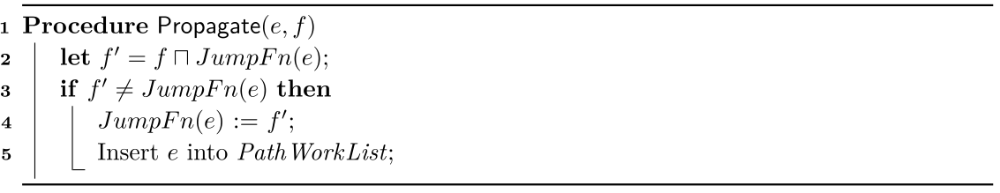

# Original IDE Algorithm

Here, we provide a copy of the pseudocode of the original IDE algorithm [[20]](#references) that is relevant to our work.

<!-- <object data="appendix.pdf" width="100%" height="1000px"></object> -->

<!--  -->
## Phase I

A shortened version of the *ForwardComputeJumpFunctionsSLRPs* procedure from phase I of the original IDE algorithm [[20]](#references).

### Propagate

The *Propagate* procedure from the original IDE algorithm [[20]](#references).

## Phase II

Phase II (value propagation and value computation) of the original IDE algorithm [[20]](#references).

### Propagate Value

The *PropagateValue* procedure from the original IDE algorithm [[20]](#references).

## References

[20] Mooly Sagiv, Thomas Reps, and Susan Horwitz. Precise Interprocedural Dataflow Analysis with Applications to Constant Propagation. Theor. Comput. Sci., 167(1-2):131–170, 1996.3
