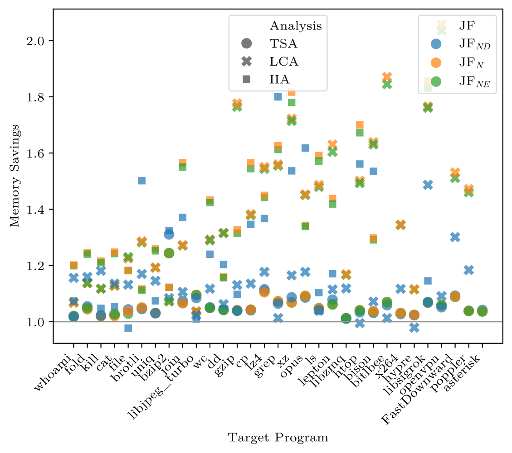

---
# Feel free to add content and custom Front Matter to this file.
# To modify the layout, see https://jekyllrb.com/docs/themes/#overriding-theme-defaults

layout: default
title: Visualizations
---

To evaluate, which jump-functions representation performs best when analyzing LLVM IR generated from real-world C and C++ programs, we visualize our experimental results in several ways.

We use scatter plots showing the IDESolver++ with the proposed jump-functions representations compared to the IDESolver++ using the nested representation inherited from PhASAR's current IDESolver.
The left plot shows the runtime speedup (higher is better), whereas the right plot shows the relative memory usage (smaller is better).

The IDESolver++ was configured to use <em>J</em><em>F</em><em>N</em><em>D</em> (blue), <em>J</em><em>F</em><em>N</em> (orange), and <em>J</em><em>F</em><em>N</em><em>E</em> (green).
The both horizontal lines are set at *1* meaning no speedup.
We use a log-scale to account for the non-linear distribution of speedups.

The target programs are ordered.
In the following, we show the same plots with different orderings for the target programs to reveal any correlations.

## Program Size Ordering

The target programs are sorted in ascending order by their number of LLVM IR instructions.
This is the plot that we show in the paper.

  

    <!--  -->
    
  

  

    <!--  -->
    
  

## Number of Procedures

The target programs are sorted in ascending order by their number of LLVM IR functions.

  

    
  

  

    
  

## Number of Address-Taken Procedures

The target programs are sorted in ascending order by their number of LLVM IR functions that are address-taken.
Hence, they are candidate targets for indirect calls through a function-pointer.

  

    
  

  

    
  

## Number of Globals

The target programs are sorted in ascending order by their number of global variables + global constants in LLVM IR.

  

    
  

  

    
  

## Number of Call-Sites

The target programs are sorted in ascending order by their number of LLVM IR call-sites.

  

    
  

  

    
  

## Number of Indirect Call-Sites

The target programs are sorted in ascending order by their number of indirect LLVM IR call-sites, i.e., through a function-pointer.

  

    
  

  

    
  

## Number of Basic Blocks

The target programs are sorted in ascending order by their number basic blocks in LLVM IR.

  

    
  

  

    
  

